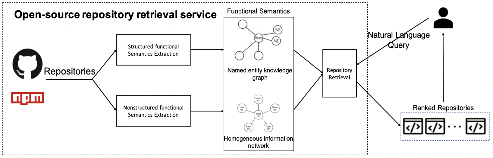
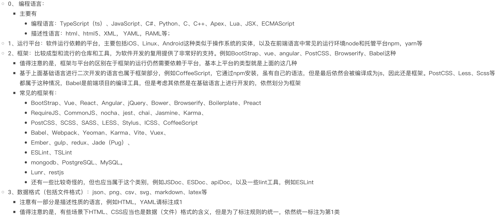
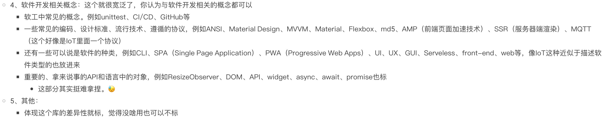

# Development Library Search System
这篇工作主要是从现有的前端开源仓库中挖掘结构化的功能语义信息和非结构化的功能语义信息，并基于此面向用户query提供检索服务.
Code for paper [An Open-source Repository Retrieval Service Using Functional Semantics for Software Developers](https://ieeexplore.ieee.org/document/9860185/)

### 数据准备
本工作爬取了NPM网站中所有可见的仓库信息，以及它们在GitHub网站中的信息，包括README信息。爬取NPM网站使用Python requests库完成，总共爬取41166个仓库。（当然，这些信息是不全的，因为顺着NPM的目录页面向下爬取，到一定深度后NPM网站便不返回数据了【笑】），GitHub网站的相关信息使用GitHub Restful API完成爬取。数据已经经过基本清洗并放在Data目录下，看看pathutil.py文件应该就知道是怎么存放的了
### 结构化功能语义信息挖掘
本工作使用命名实体识别抽取结构化的命名实体，具体来说就是类似于react，javascript等这些命名实体，我们认为这些实体极强地展示了目标仓库的部分功能语义特征。我们按照如下的规则标注了具体标注的实体类型以及它们具体的语义信息。总之我们拿到了分别标注好的约4200条和3800条GitHub仓库描述句子以及README句子。

本工作最后使用的NER模型基于bert-large预训练模型，并在其上叠加空洞卷积、LSTM、CRF层得到。
得到了这些信息之后，本工作围绕仓库构建了一张知识图谱，节点主要包括仓库、NPM关键词、GitHub Topic以及六类命名实体，为了捕捉它们之间的语义关系，本工作使用了TransE知识图谱嵌入模型为每个实体和关系的嵌入向量表示，这部分使用thunlp开源的[OpenKE](https://github.com/thunlp/OpenKE)工具完成。至于为什么使用TransE知识图谱嵌入模型，因为它有较好的解释性，在下游搜索任务的实现可以看到它的用处。
### 非结构化功能信息挖掘
在得到命名实体表征的结构化功能信息之后，我们发现有些词并不是命名实体，但同样对仓库的功能特征施加了约束，例如light-weighted等常见词，为此，本工作从仓库描述和README文件中抽取了全部的**形容词**和**名词**，并将此组织成一张HIN（Heterogeneous Information Network），使用基于meta-path的嵌入学习算法[ESim](https://github.com/shangjingbo1226/ESim)，得到每个小词的嵌入向量表示。
### 检索算法实现
检索算法的目标是给出query和某个仓库的匹配分数，主要来自结构化功能信息和非结构化功能信息的匹配分数的加权平均。
- 结构化功能信息匹配分数：
主要是根据连接信息以及$ cos\_sim(ke_{ne} - ke_{rel}, ke_r)$得到，这部分使用到了TransE对嵌入向量学习的约束，即尾实体的嵌入向量应该和头实体嵌入向量加上边嵌入向量相近，这个公式其实就是这个假设的反用【算得上我全部的巧思了（笑）】。
- 非结构化功能信息匹配分数：这部分主要是关键词HIN嵌入和仓库的相似度来判断，因为基于meta-path的嵌入向量学习方式本身便会倾向于使得同一条meta-path上的节点的嵌入向量表达相近。
### 项目运行
按照python文件的标序运行即可（够傻瓜吧），一些需要配置的算法，例如ESim，基本上我已经把build出来的信息也放到这个仓库中了，不出意外的话，应该可以直接运行（笑），数据部分没有上传在这个仓库，后面会将其上传到百度网盘中，并将链接放在这里（此处先按下不表）。
